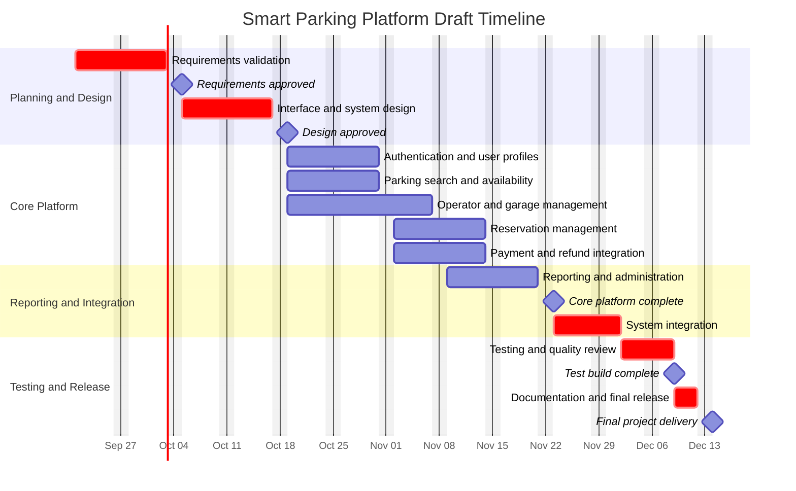

# Smart Parking Platform

## Homework 2: Work Breakdown Structure and Project Timeline

**Course:** CIS 4374  
**Student:** Sarrthi Jasrotia  
**Company:** WE ARE Software Corp.  
**Date:** September 17, 2026

## 1. Work Breakdown Structure

The Work Breakdown Structure organizes the Smart Parking Platform into major deliverables, modules, and features. It focuses on what the project will produce. The hierarchy contains four levels, exceeding the requirement of at least three levels.

### 1.0 Smart Parking Platform

- **1.1 User Access and Account Management**
  - **1.1.1 Authentication System**
    - 1.1.1.1 User registration
    - 1.1.1.2 Secure login
    - 1.1.1.3 Password recovery
    - 1.1.1.4 Session management
  - **1.1.2 Driver Account**
    - 1.1.2.1 Driver profile
    - 1.1.2.2 Vehicle information
    - 1.1.2.3 Payment methods
    - 1.1.2.4 Notification preferences
  - **1.1.3 Operator Account**
    - 1.1.3.1 Operator profile
    - 1.1.3.2 Facility permissions
    - 1.1.3.3 Staff access roles

- **1.2 Parking Search and Availability**
  - **1.2.1 Parking Search**
    - 1.2.1.1 Destination search
    - 1.2.1.2 Current-location search
    - 1.2.1.3 Search filters
  - **1.2.2 Parking Map**
    - 1.2.2.1 Interactive map
    - 1.2.2.2 Parking-location markers
    - 1.2.2.3 Navigation-service integration
  - **1.2.3 Availability Information**
    - 1.2.3.1 Real-time space availability
    - 1.2.3.2 Parking rates
    - 1.2.3.3 Operating hours and restrictions

- **1.3 Reservation Management**
  - **1.3.1 Reservation System**
    - 1.3.1.1 Date and time selection
    - 1.3.1.2 Space reservation
    - 1.3.1.3 Reservation confirmation
  - **1.3.2 Reservation Changes**
    - 1.3.2.1 Reservation modification
    - 1.3.2.2 Reservation cancellation
    - 1.3.2.3 Availability update
  - **1.3.3 Driver Records**
    - 1.3.3.1 Reservation history
    - 1.3.3.2 Digital parking pass
    - 1.3.3.3 Reminders and alerts

- **1.4 Parking Facility Management**
  - **1.4.1 Facility Setup**
    - 1.4.1.1 Facility information
    - 1.4.1.2 Operating hours
    - 1.4.1.3 Parking rules and amenities
  - **1.4.2 Space Management**
    - 1.4.2.1 Parking-space inventory
    - 1.4.2.2 Space status
    - 1.4.2.3 Accessible parking designation
  - **1.4.3 Pricing Management**
    - 1.4.3.1 Hourly rates
    - 1.4.3.2 Event and special rates
    - 1.4.3.3 Pricing updates
  - **1.4.4 Garage Monitoring**
    - 1.4.4.1 Occupancy dashboard
    - 1.4.4.2 Reservation monitoring
    - 1.4.4.3 Availability synchronization

- **1.5 Payment and Billing**
  - **1.5.1 Payment Processing**
    - 1.5.1.1 Payment-provider integration
    - 1.5.1.2 Payment authorization
    - 1.5.1.3 Payment confirmation
  - **1.5.2 Billing Records**
    - 1.5.2.1 Digital receipts
    - 1.5.2.2 Transaction history
    - 1.5.2.3 Financial records
  - **1.5.3 Refund Management**
    - 1.5.3.1 Refund eligibility
    - 1.5.3.2 Refund processing
    - 1.5.3.3 Refund confirmation

- **1.6 Reporting and Administration**
  - **1.6.1 Operational Reporting**
    - 1.6.1.1 Occupancy reports
    - 1.6.1.2 Reservation reports
    - 1.6.1.3 Usage trends
  - **1.6.2 Financial Reporting**
    - 1.6.2.1 Revenue reports
    - 1.6.2.2 Refund reports
    - 1.6.2.3 Report export
  - **1.6.3 System Administration**
    - 1.6.3.1 User management
    - 1.6.3.2 Role and permission management
    - 1.6.3.3 System activity review

- **1.7 Quality Assurance and Release**
  - **1.7.1 System Testing**
    - 1.7.1.1 Functional testing
    - 1.7.1.2 Integration testing
    - 1.7.1.3 Performance testing
  - **1.7.2 Security and Accessibility**
    - 1.7.2.1 Security testing
    - 1.7.2.2 Privacy review
    - 1.7.2.3 Accessibility review
  - **1.7.3 Final Release**
    - 1.7.3.1 Deployment package
    - 1.7.3.2 User documentation
    - 1.7.3.3 Final project delivery

## 2. Draft Project Timeline

The timeline uses estimation by analogy with a semester software project. The dates are initial estimates and may change as requirements develop. Work may proceed in parallel when dependencies allow.

| ID | Project activity | Start | Finish | Duration | Dependency |
|---|---|---|---|---:|---|
| T1 | Requirements validation | Sep. 21, 2026 | Oct. 2, 2026 | 10 workdays | None |
| T2 | Interface and system design | Oct. 5, 2026 | Oct. 16, 2026 | 10 workdays | T1 |
| T3 | Authentication and user profiles | Oct. 19, 2026 | Oct. 30, 2026 | 10 workdays | T2 |
| T4 | Parking search and availability | Oct. 19, 2026 | Oct. 30, 2026 | 10 workdays | T2 |
| T5 | Operator and garage management | Oct. 19, 2026 | Nov. 6, 2026 | 15 workdays | T2 |
| T6 | Reservation management | Nov. 2, 2026 | Nov. 13, 2026 | 10 workdays | T4 |
| T7 | Payment and refund integration | Nov. 2, 2026 | Nov. 13, 2026 | 10 workdays | T3 |
| T8 | Reporting and administration | Nov. 9, 2026 | Nov. 20, 2026 | 10 workdays | T5 |
| T9 | System integration | Nov. 23, 2026 | Dec. 1, 2026 | 7 workdays | T6, T7, T8 |
| T10 | Testing and quality review | Dec. 2, 2026 | Dec. 8, 2026 | 5 workdays | T9 |
| T11 | Documentation and final release | Dec. 9, 2026 | Dec. 11, 2026 | 3 workdays | T10 |

### Project Milestones

| Milestone | Target date | Completion condition |
|---|---|---|
| Requirements approved | Oct. 2, 2026 | Initial requirements and scope receive approval |
| Design approved | Oct. 16, 2026 | Interface design and system architecture are complete |
| Core platform complete | Nov. 20, 2026 | Major driver and operator functions are integrated |
| Test build complete | Dec. 8, 2026 | Integration, security, and accessibility testing are complete |
| Final project delivery | Dec. 11, 2026 | Final platform package and documentation are delivered |

## 3. Gantt Chart

## 4. Timeline Assumptions

- The project team can work on independent components at the same time.
- Requirements must be approved before design begins.
- System design must be approved before development begins.
- Reservation development depends on the parking search and availability component.
- Payment development depends on authentication and user-account functionality.
- System integration begins after the core platform and reporting components are ready.
- The team will update the timeline if the project scope or requirements change.

